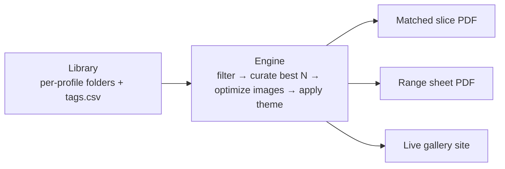

# Logo Showcase System — Build Spec

**Owner:** HaseebMadeIt (Ash)
**Status:** Spec for review → build
**Renderer proven:** Python + WeasyPrint (HTML/CSS → PDF), Pillow for image prep

---

## 1. What this is

Internal tooling that turns a **tagged logo library** into small, **client-matched PDF slices** — one engine that wears a **different face per profile** (Storm, Eikon, Grid, Dygram, …).

The library can hold hundreds of logos. It is never sent as one file. The deliverable is always a small, filtered slice built for the specific client.

**One library → three outputs:**

| Output | Format | Use | Weight |
|---|---|---|---|
| Matched slice | PDF | Default. Logos that fit this client. | ~1–2 MB |
| Range sheet | PDF | "Show me your range." Dense contact sheet. | ~1–2 MB |
| Live gallery | Web (static) | Internal. Team browses + picks fast. | n/a |

---

## 2. Core principle

> The library is **data**. The PDF is only ever a small, relevant **slice** of it.

This kills the heavy whole-catalog PDF. Volume is not the goal — **relevance** is. A client wants 8–12 strong, on-point examples, not 200 unrelated ones.

---

## 3. Architecture



Plain version: **library (data) → engine (filter by query, pick best N, apply the profile's theme, render) → output (one of three modes).**

---

## 4. Repository layout

```
logo-showcase/
├── profiles/
│   ├── storm/
│   │   ├── logos/                 # master images (source of truth)
│   │   │   ├── apex-builders.png
│   │   │   └── greenleaf.png
│   │   ├── tags.csv               # the label list (join key = file)
│   │   └── theme.json             # this profile's face
│   ├── eikon/
│   │   └── …
│   └── grid/ …
├── engine/
│   ├── showcase.py                # CLI entrypoint
│   ├── library.py                 # load + validate tags.csv, resolve files
│   ├── curate.py                  # filter + rank → best N
│   ├── images.py                  # screen-res preview generation + cache
│   ├── render_slice.py            # matched slice PDF
│   ├── render_range.py            # range sheet PDF
│   ├── build_gallery.py           # static gallery + manifest.json
│   ├── theme.py                   # load/validate theme.json
│   └── vocab.py                   # controlled vocabulary (industry + type)
├── build/                         # generated previews + manifests (gitignored)
├── out/                           # generated PDFs (gitignored)
├── fonts/                         # embedded fonts (Archivo, Spectral, …)
└── SYSTEM.md
```

**Storage:** local drive is primary. Google Drive is an optional mirror — same tree, same files. No API dependency; a synced folder is enough.

---

## 5. The library

**Master images**
- Format: PNG, transparent background preferred.
- Min size: 1200px on the longest edge (so previews stay crisp).
- Filename = the join key. `kebab-case`, unique within the profile, matches the `file` column in `tags.csv`.
- Masters are never embedded directly — the engine generates optimized previews from them.

---

## 6. Tag schema — `tags.csv`

One row per logo. UTF-8, comma-separated, header row required.

| Column | Required | Type | Notes |
|---|---|---|---|
| `file` | yes | string | Filename in `logos/`. Join key. |
| `name` | yes | string | Display/brand name shown on the tile. |
| `industries` | yes | enum list | One or more, `\|`-separated. Values from the industry vocab. |
| `types` | yes | enum list | One or more, `\|`-separated. Values from the type vocab. |
| `tier` | yes | int 1–5 | Curation rank. **1 = flagship (best)**, 5 = filler. |
| `year` | no | int | Used as a tie-breaker (newer first). |
| `active` | no | bool | `false` hides it from all outputs. Defaults to `true`. |
| `notes` | no | string | Free text, ignored by the engine. |

**Dual-tagging rule:** a logo can carry multiple industries **and** multiple types. It surfaces under **any** query that matches one of its labels. Tag once, slice infinitely.

**Example**

```csv
file,name,industries,types,tier,year,active
apex-builders.png,Apex Builders,construction|real-estate,abstract,1,2024,true
greenleaf.png,GreenLeaf,health-medical|fitness-wellness,pictorial,2,2023,true
veritas.png,Veritas,finance-banking,wordmark,1,2025,true
buddy-co.png,Buddy Co,kids,mascot,3,2022,false
```

---

## 7. Controlled vocabulary

Values **must** come from these lists. The engine validates on load and **errors on any unknown value** (prevents `construction` vs `Construction` vs `constructions` drift). Both lists live in `vocab.py` and are extend-only.

**Industry** (starter set — extend as needed):
`construction`, `real-estate`, `architecture-interior`, `finance-banking`, `insurance`, `technology-saas`, `ai-data`, `ecommerce-retail`, `fashion-apparel`, `beauty-cosmetics`, `health-medical`, `fitness-wellness`, `food-beverage`, `hospitality-travel`, `education`, `professional-services`, `legal`, `marketing-agency`, `logistics-transport`, `automotive`, `industrial-manufacturing`, `energy`, `marine`, `agriculture`, `kids`, `sports`, `media-entertainment`, `nonprofit`

**Type** (canonical logo taxonomy — fixed 7):
`wordmark`, `lettermark`, `pictorial`, `abstract`, `mascot`, `combination`, `emblem`

> `monogram` is accepted as an alias of `lettermark`. Add aliases in `vocab.py`, not new canonical values.

---

## 8. The engine

**CLI**

```bash
# matched slice for a construction client (Storm profile)
python -m engine.showcase --profile storm --industry construction --mode slice --count 12 \
       --out out/storm-construction.pdf

# by type instead of industry
python -m engine.showcase --profile eikon --type abstract --mode slice

# combine filters: finance AND wordmark
python -m engine.showcase --profile grid --industry finance-banking --type wordmark --match all

# range sheet (whole profile, or filtered the same way)
python -m engine.showcase --profile storm --mode range --out out/storm-range.pdf

# rebuild the gallery site for a profile
python -m engine.build_gallery --profile storm
```

**Inputs**
- `--profile` (required): which profile's library + theme to use.
- Query: `--industry` and/or `--type` (each repeatable). `--match any` (default, OR) or `--match all` (AND).
- `--mode`: `slice` (default) | `range`.
- `--count`: cap for slice mode. Default **12**.
- `--out`: output path. Auto-named if omitted.

**Pipeline**
1. **Load** `theme.json` and `tags.csv` for the profile.
2. **Validate** every tag against `vocab.py`; fail loudly on unknown values or missing image files.
3. **Filter** rows by the query (`any`/`all`), drop `active = false`.
4. **Curate** → sort by `tier` ascending, then `year` descending, then file order; take top `count`.
5. **Optimize images** → generate/reuse cached screen-res previews.
6. **Render** the chosen mode with the profile theme.
7. **Write** to `out/` and report path + file size.

**Edge cases**
- No matches → print a clear message, write nothing, exit non-zero. Never emit a broken/empty PDF.
- Fewer matches than `count` → take all.
- Missing master file referenced in `tags.csv` → error naming the file.

---

## 9. Output modes

### 9.1 Matched slice (PDF) — default
- Layout: short cover (profile-themed) + grid of N tiles. Each tile = preview + `name · Type`.
- Caps at `--count` (default 12). Target **< 2 MB**.
- This is the file the client receives.

### 9.2 Range sheet (PDF)
- Dense contact sheet: many small tiles per page, light captions. Paginate if needed.
- Same filter options as slice; used to show breadth. Target **< 2 MB**.

### 9.3 Live gallery (web — Phase 3)
- **Static** HTML/CSS/vanilla JS reading a generated `manifest.json`. No backend.
- Filter by industry/type, search by name, multi-select → export a slice list (file names) the engine turns into a PDF.
- **Internal only.** Never linked in a Fiverr delivery (off-platform link = account risk). PDF stays the client-facing channel.

---

## 10. Theme system (per profile)

Each profile gets its own `theme.json`. Ten profiles = ten distinct faces, so two never read as related. **Designing the 10 themes is a separate deliverable** — this spec defines the shape they plug into.

```json
{
  "id": "storm",
  "name": "Storm Designs",
  "sort_primary": "industry",
  "palette": {
    "ink": "#15181E",
    "paper": "#FFFFFF",
    "accent": "#E2683C",
    "accent_soft": "#FBEDE6",
    "muted": "#6B7280",
    "cover_bg": "#15181E",
    "cover_fg": "#FFFFFF"
  },
  "fonts": { "display": "Archivo", "body": "Archivo", "serif": "Spectral" },
  "layout": { "cover_style": "dark", "tile_cols": 3, "tile_radius_mm": 3, "density": "comfortable" },
  "labels": { "slice_kicker": "Selected work", "range_title": "Full range" }
}
```

- `sort_primary` — does this profile lead by `industry` or by `type`. Per-profile, to reinforce the "ten studios" effect.
- Fonts must exist in `fonts/`. Palette drives every surface; nothing hard-coded in the renderers.

---

## 11. Image pipeline

- Previews generated to `build/<profile>/previews/`, fit to tile, **max 1200px** longest edge, target **≤ 120 KB** each (PNG or optimized JPG).
- **Cache by source hash** — regenerate a preview only when its master changes. Keeps repeat runs fast.
- Fonts embedded in the PDF via `@font-face` (Archivo, Spectral, and any per-theme additions).
- Result: a 12-logo slice lands ~1–2 MB; a whole-library PDF is never produced.

---

## 12. Tech stack

| Layer | Choice | Why |
|---|---|---|
| Language | Python 3.11 | Matches existing pipelines. |
| PDF render | WeasyPrint | Already proven here; HTML/CSS control. |
| Images | Pillow | Resize, optimize, hash-cache. |
| Data | csv / pandas | `tags.csv` is the source of truth. |
| CLI | argparse (or click) | Simple, scriptable. |
| Gallery | static HTML/CSS/JS + `manifest.json` | No backend, no off-platform risk. |

---

## 13. Build phases

**Phase 1 — MVP (the engine that earns its keep)**
Library structure + `tags.csv` + `vocab.py` + `theme.py` + image pipeline + **matched slice renderer**. One profile, end to end.

**Phase 2 — Range sheet**
Contact-sheet renderer reusing the same library + pipeline.

**Phase 3 — Live gallery**
`manifest.json` generator + static browse/filter/search/select site. Internal tool.

---

## 14. Acceptance criteria (Phase 1)

- [ ] Given a profile with labelled logos + `tags.csv`, `--mode slice --industry X` outputs a PDF.
- [ ] PDF contains **only** matching logos, capped at `--count`, ordered by `tier` then `year`.
- [ ] PDF uses **that profile's** theme (palette, fonts, layout) — nothing hard-coded.
- [ ] Tiles show **real logo previews** (screen-optimized), never filenames.
- [ ] 12-logo slice is **< 2 MB**.
- [ ] Unknown tag value or missing image **fails loudly** with a clear message.
- [ ] Zero matches → clean message, no broken PDF.

---

## 15. Non-goals

- No whole-library PDF, ever.
- No external links in client-facing delivery (Fiverr on-platform only).
- No database/backend in v1 — `tags.csv` is the source of truth.

---

## 16. Open decisions (need Ash)

1. **Sort axis** — confirm `sort_primary` is set **per profile** (recommended), default `industry`.
2. **Slice default count** — 12 confirmed, or different?
3. **Ten theme designs** — produce all now, or design alongside the build, profile by profile?
4. **Google Drive** — manual synced-folder mirror (recommended for v1) or API sync later?
